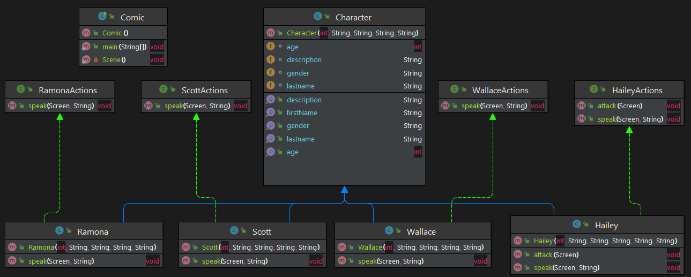
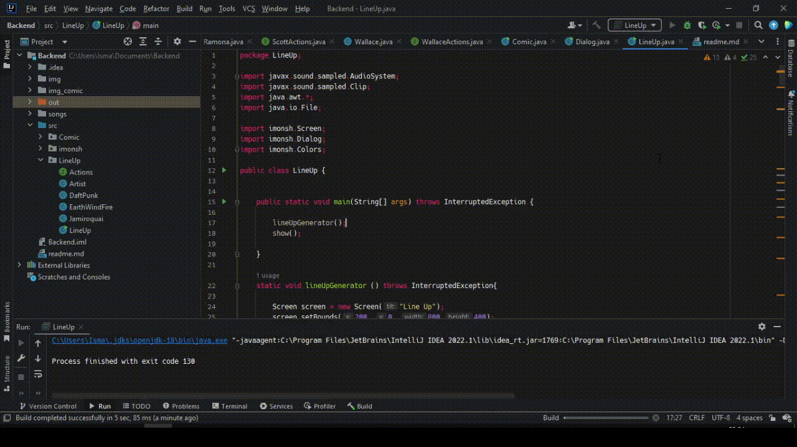
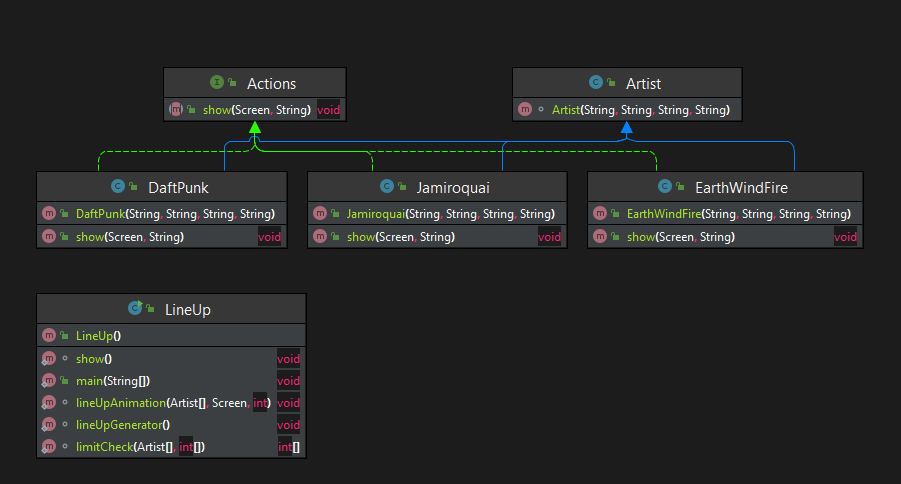

<h2> Desarrollo de Katas BackEnd-Java de Launch X </h2>
Aviso: Repositorio creado con fines didácticos. 

En las katas presentadas se utilizó el Framework <i>imonsh</i> desarrollado por la Sherpa/MC [Fernanda Ochoa](https://github.com/FernandaOchoa). Los archivos correspondientes no se encuentran debido a permisos asi como las imágenes y archivos de audio utilizados. 

<h3> Kata: Crear Cómic</h3>
Crear un cómic modelando las clases, interfaces e hilos correspondientes para contar una historia de 2 minutos de duración.
 

<h4> Diagrama </h4>

<h3> Kata: Crear LineUp</h3>   
Diseñar LineUp de un concierto.

Se creó un pequeño LineUp animado para el Festival **Launchella**

Y un concierto

https://user-images.githubusercontent.com/92187317/165888600-c1a95590-7dcc-435a-9922-8f8fa45006d0.mov

<h4> Diagrama </h4>

